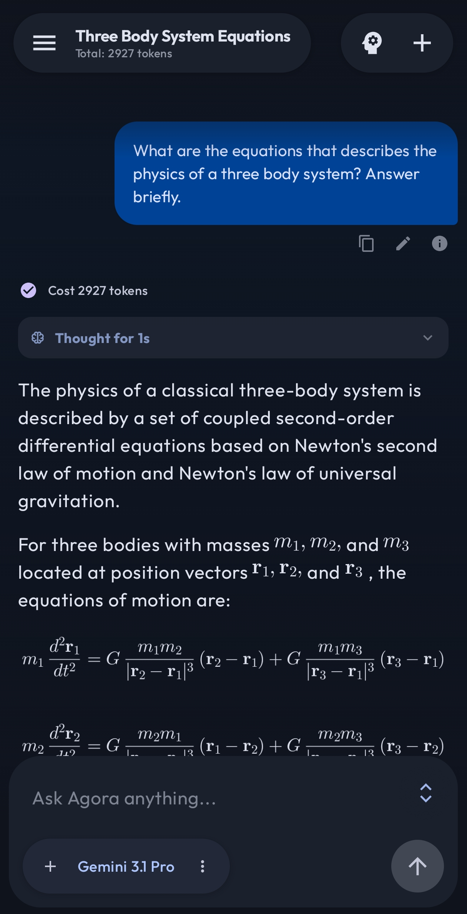

  

  # Agora
  
  **BYOK LLM client with multi-provider access, agentic workflows, and remote device control.**

  
  
  

---

Official LLM apps are often heavily restricted, wrapping capable AI models in sanitized, linear interfaces. **Agora is different.**

Agora is a fully open-source, BYOK (Bring Your Own Key) Android client for power users. It connects directly to 8+ AI providers with no intermediary servers or tracking, supports non-linear conversation branching, runs local models on-device, and controls remote machines through an encrypted agent protocol. Built with Jetpack Compose and Kotlin coroutines.

## Screenshots

<table>
<tr>
<td width="33%"></td>
<td width="33%"></td>
<td width="33%"></td>
</tr>
</table>

## Why Agora?

- **No Middlemen:** Direct API connections. No telemetry, no tracking, no corporate servers logging your conversations. Everything lives locally in a Room database.
- **Non-Linear Thought:** A tree-structured message database lets you edit any past message, regenerate responses, and explore alternative branches without losing context.
- **Agentic by Default:** Multi-round tool calling with web search, code execution, file operations on remote devices, memory management, and semantic conversation search.
- **Remote Control:** Manage servers, edit files, and search code on remote machines via the [Conch](https://github.com/newo-ether/conch) protocol — end-to-end encrypted with ECDH + AES-256-GCM.

## Features

### Multi-Provider Access
- **8 built-in providers:** OpenAI, Anthropic, Google Gemini, DeepSeek, Qwen (DashScope), OpenRouter, Ollama, and Local (GGUF via llama.cpp)
- **Custom providers** with arbitrary base URLs and API keys
- **BYOK:** Bring your own API keys — no subscriptions, no middlemen
- **Multiple API keys per provider** with named aliases for easy rotation
- Per-provider base URL override for proxies and self-hosted endpoints

### Agentic Tools
The model can invoke these tools autonomously in multi-round loops:
- **Web Search** — Brave, Serper, Tavily, and SearXNG integration
- **Code Execution** — Gemini code execution for running and testing code inline
- **Remote Shell** (`shell_execute`) — Execute commands on remote servers via Conch
- **File Operations** (`file_read`, `file_write`, `file_edit`, `file_glob`, `file_grep`) — Native filesystem I/O on remote devices through the Conch protocol
- **Memory** (`memory_read`, `memory_write`) — Persistent active memory and saved memory files across conversations
- **Conversation Search** (`search_conversations`) — RAG-powered semantic search over chat history

### Thinking & Reasoning
- Deep reasoning support: OpenAI o1/o3, Anthropic extended thinking, Gemini thinking, DeepSeek-R1, Qwen QwQ
- Configurable thinking level (low/medium/high)
- Streaming think-tag renderer with collapsible UI and duration tracking

### On-Device Intelligence
- **Local LLM inference** via llama.cpp — run GGUF models entirely offline
- **Local embeddings** for on-device semantic search (RAG) over conversation history
- **Ollama** provider for self-hosted models on your local network

### Remote Device Control (Conch Protocol)
- ECDH key exchange + AES-256-GCM encryption + HMAC-SHA256 signing
- Token bucket rate limiting and nonce-based anti-replay protection
- **Multi-device support** — configure and switch between multiple remote servers
- **MCP integration** — use Conch as a Claude Desktop MCP server for remote file/shell access
- Each device configurable with name, URL, API key, and description

### Knowledge Management
- **RAG-powered semantic search** across all past conversations using cosine similarity
- Configurable similarity threshold and keyword/model search methods
- Selectable embedding model (remote or local) independent of chat model
- **Context window management** with real-time token counting and sliding window
- Visual context rollout indicator dims messages outside the active window

### Data Portability
- **.agora Export/Import:** Conversations, memories, prompts, settings, and API keys in one portable file
- **Merge, Replace, and Skip import strategies**
- **Third-Party Import:** Claude and ChatGPT export formats (.zip / .json)
- API key safety warnings for both export and import workflows

### Customization
- **System prompt templates** with three-section editor (system prompt + user prepend + user append)
- Variable substitution: `{sent_time}`, `{sent_date}`, and extensible variable system
- Per-conversation model and system prompt switching
- Per-message model selection from the chat bottom bar
- **Auto title generation** with configurable model

### UI & UX
- Modern Material 3 design in Jetpack Compose
- **Non-linear branching:** Edit any past message and branch into alternative conversation paths
- Real-time streaming with message anchoring and animated auto-scrolling
- Immersive gesture-driven image viewer
- Markdown rendering with syntax highlighting, LaTeX math, and code blocks
- Image, video, and file attachment support with thumbnails
- English and Chinese (中文) language support

## Getting Started

### Prerequisites
- [Android Studio](https://developer.android.com/studio) (Ladybug or newer recommended)
- Android SDK 34+
- A valid API key from a supported provider

### Installation

<table>
<tr>
<td width="33%"><b>① Clone</b> <code>git clone https://github.com/newo-ether/Agora.git</code></td>
<td width="33%"><b>② Open</b> Open the project in Android Studio.</td>
<td width="33%"><b>③ Build</b> Sync Gradle and build.</td>
</tr>
</table>

### Configuration

<table>
<tr>
<td width="20%"><b>① Launch</b> Open Agora on your device.</td>
<td width="20%"><b>② Settings</b> Open <b>Settings</b> from the nav bar.</td>
<td width="20%"><b>③ API Key</b> Select a <b>Provider</b> and add your <b>API Key</b>.</td>
<td width="20%"><b>④ Models</b> <b>Models</b> → "Sync from All Providers."</td>
<td width="20%"><b>⑤ Customize</b> System prompts, context, search, memory.</td>
</tr>
</table>

### Running Local Models

<table>
<tr>
<td width="25%"><b>① Place</b> Put a GGUF model file on your device.</td>
<td width="25%"><b>② Import</b> Settings → Provider → Local → "Import GGUF Model".</td>
<td width="25%"><b>③ Configure</b> Set context size, temperature, and other parameters.</td>
<td width="25%"><b>④ Select</b> Choose your local model from the chat picker.</td>
</tr>
</table>

### Setting Up Remote Shell (Conch)

<table>
<tr>
<td width="33%"><b>① Deploy</b> Deploy the <a href="https://github.com/newo-ether/conch">Conch server</a> on your target machine.</td>
<td width="33%"><b>② Add Device</b> Settings → Shell Devices → add URL and API key.</td>
<td width="33%"><b>③ Use</b> The model auto-discovers shell devices for commands, files, and search.</td>
</tr>
</table>

## Tech Stack

- **Language:** [Kotlin](https://kotlinlang.org/)
- **UI Framework:** [Jetpack Compose](https://developer.android.com/jetpack/compose) (Material 3)
- **Architecture:** MVVM with Kotlin Coroutines & Flow
- **Local Storage:** [Room Database](https://developer.android.com/training/data-storage/room) with tree-structured message schema & DataStore Preferences
- **Networking:** `HttpURLConnection` with SSE streaming, OkHttp for Ollama
- **Serialization:** `kotlinx.serialization`
- **Native:** llama.cpp via Android NDK (CMake) for on-device LLM inference and embeddings
- **Image Loading:** Coil
- **Markdown:** Multiplatform Markdown Renderer M3
- **Math:** JLaTeXMath-Android

## Contributing

Contributions are welcome! Feel free to fork the repository, submit pull requests, or open an issue.

## License

This project is open-source under the [MIT License](LICENSE).
